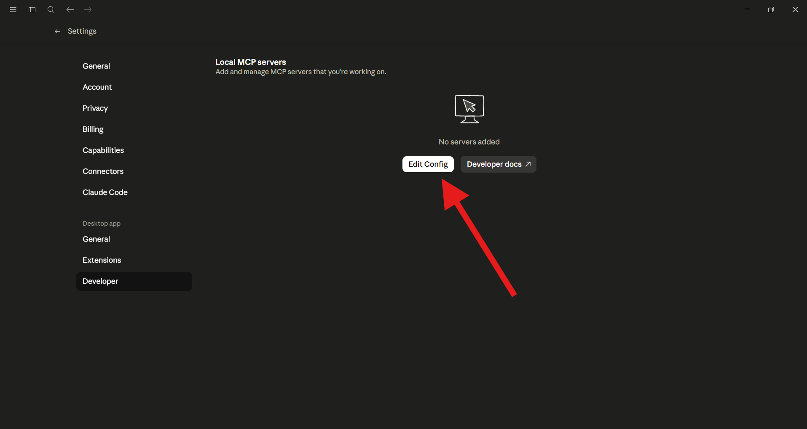
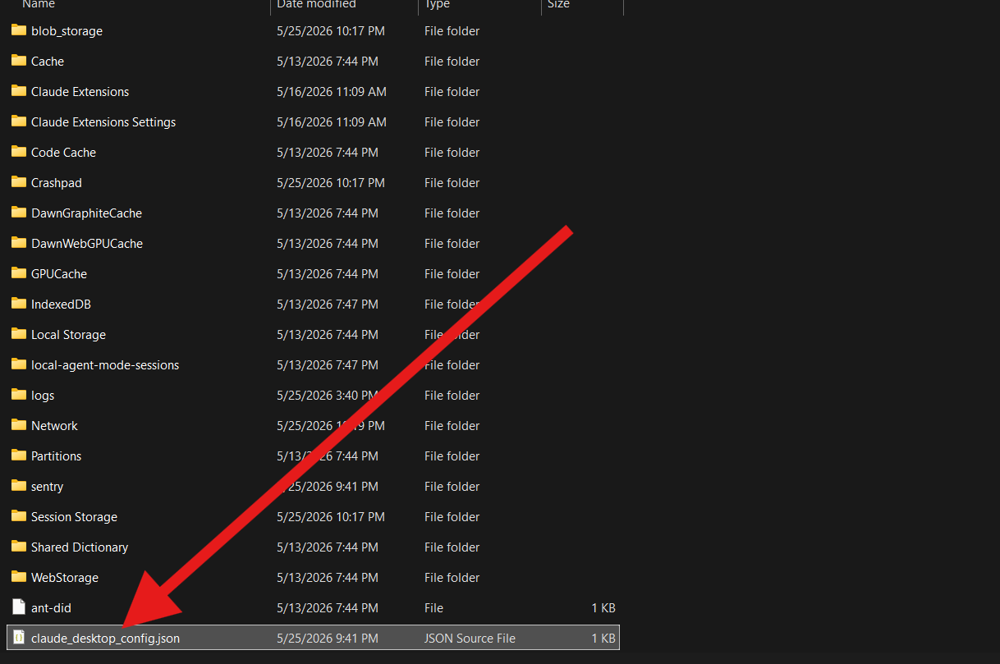
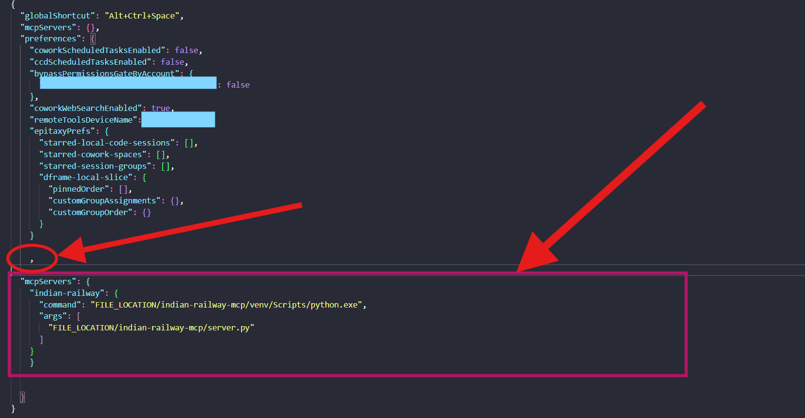
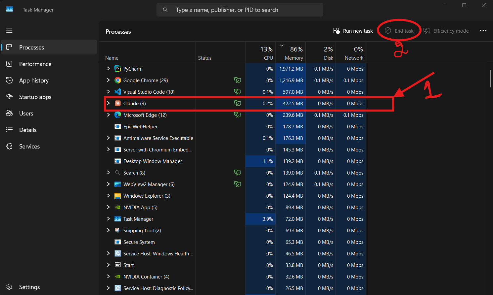
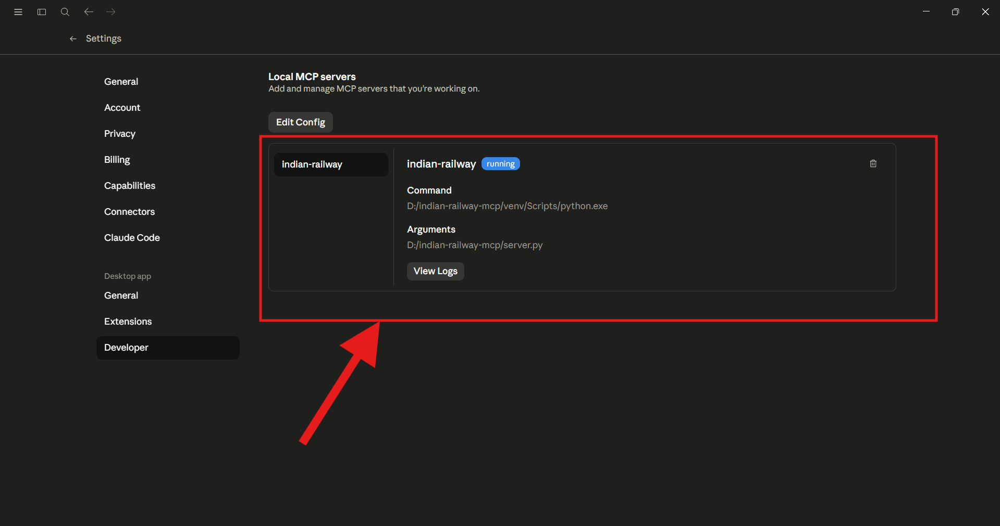
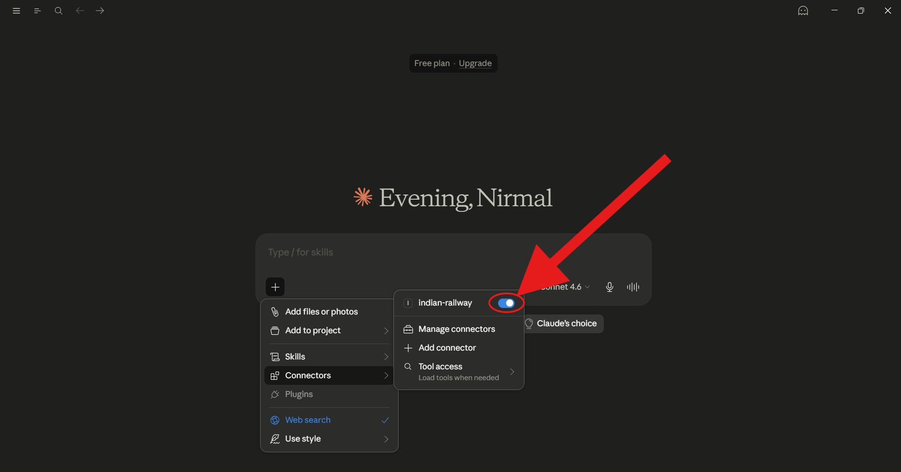

# 🚆 Indian Railway MCP — Setup Guide for Claude Desktop

Connect the **Indian Railway MCP server** to Claude Desktop and get real-time train data,  station lookups, and more — right inside your Claude conversations.

---

## 📋 Prerequisites

Before you begin, make sure you have:

- ✅ **Claude Desktop** installed ([download here](https://claude.com/download))
- ✅ The **Indian Railway MCP server** file saved somewhere on your device
- ✅ A text editor (Notepad, VS Code, or any editor you prefer)

---

## 🪜 Step-by-Step Setup

---

### Step 1 — Open Claude Desktop

Launch the Claude Desktop app. If you haven't installed it yet, download it from [https://claude.com/](https://claude.com/) and complete the installation first.

---

### Step 2 — Navigate to Developer Settings

1. Click on **Settings** (gear icon or from the menu)
2. Go to the **Developer** tab
3. Click **Edit Config**



> 💡 **Tip:** The config file controls which MCP servers Claude Desktop loads on startup. This is where you'll register the Indian Railway MCP.

---

### Step 3 — Open the Config File

Your system's default editor (or whichever editor is associated with JSON files) will open the Claude config file automatically.

If it doesn't open automatically, locate the file manually and open it with a text editor like **VS Code**, **Notepad++**, or the built-in Notepad.



---

### Step 4 — Add the MCP Server Config

Inside the config file, you'll see a JSON structure. Add the Indian Railway MCP configuration block under the `mcpServers` key.

**⚠️ Important:** If there are already other entries in `mcpServers`, make sure to add a **comma** after the previous entry before adding the new block.

```json
{
  "mcpServers": {
    "indian-railway": {
      "command": "FILE_LOCATION/indian-railway-mcp/venv/Scripts/python.exe",
      "args": [
        "FILE_LOCATION/indian-railway-mcp/server.py"
      ]
    }
  }
}
```

Replace `/YOUR/FILE/PATH/HERE/indian-railway-mcp.js` with the **actual path** on your device where the MCP server file is saved.

**Example paths:**
- **Windows:** `C:\\Users\\YourName\\mcp-servers\\indian-railway-mcp.js`
- **macOS/Linux:** `/Users/YourName/mcp-servers/indian-railway-mcp.js`



> 💡 **Tip:** Double-check that commas are correctly placed between JSON entries. A missing or extra comma will cause the config to fail to load.

---

### Step 5 — Save the Config File

Save the file using:
- **Windows/Linux:** `Ctrl + S`
- **macOS:** `Cmd + S`

Make sure the file is saved before proceeding to the next step.

---

### Step 6 — Fully Quit Claude Desktop

Claude Desktop needs to be **completely restarted** — not just minimized — for the new config to take effect.

1. Open **Task Manager** (Windows: `Ctrl + Shift + Esc` | macOS: `Activity Monitor`)
2. Find the **Claude** process
3. Click **End Task** (Windows) or **Force Quit** (macOS)



> ⚠️ **Why this step matters:** Simply closing the window may leave Claude running in the background. Ending the task ensures it fully restarts and reloads the config.

---

### Step 7 — Restart Claude Desktop

Open Claude Desktop again from your applications or start menu. It will now load with the updated config, including your newly added Indian Railway MCP server.

---

### Step 8 — Verify the MCP Server is Running

1. Go to **Settings → Developer** tab
2. You should now see **Indian Railway MCP** listed and marked as running locally ✅



If it doesn't appear, double-check:
- The file path in the config is correct
- The JSON syntax is valid (no missing commas or brackets)
- The MCP server file exists at the specified location

---

### Step 9 — Enable in Claude Chat Connectors

The final step is to make sure the Indian Railway MCP is **enabled** in your Claude chat interface.

1. Go to **Connectors** in Claude chat settings
2. Find **Indian Railway** in the list
3. Toggle it **ON** ✅



---

## ✅ You're All Set!

You can now ask Claude questions like:

- *"What is the status of train 12951?"*
- *"Find trains from Chennai to Mumbai tomorrow"*
- *"List all stations between Delhi and Bangalore"*

---

## 🛠️ Troubleshooting

| Issue | Possible Fix |
|---|---|
| MCP not showing in Developer tab | Check JSON syntax in config — use a JSON validator |
| Wrong file path error | Confirm the exact path to your `.js` MCP file |
| Claude didn't reload the config | Make sure you fully quit via Task Manager, not just closed the window |
| MCP shows but not working in chat | Ensure the toggle is ON in Connectors settings |

---

## 📎 Resources

- [Claude Desktop Download](https://claude.com/)
- [MCP Documentation for claude](https://docs.anthropic.com)
- [Indian Railway MCP Server Repo](https://github.com/Nirmal2007/indian-railway-mcp)

---

*Made with ❤️ for train travellers and AI enthusiasts.*

*Copyright © 2026*
