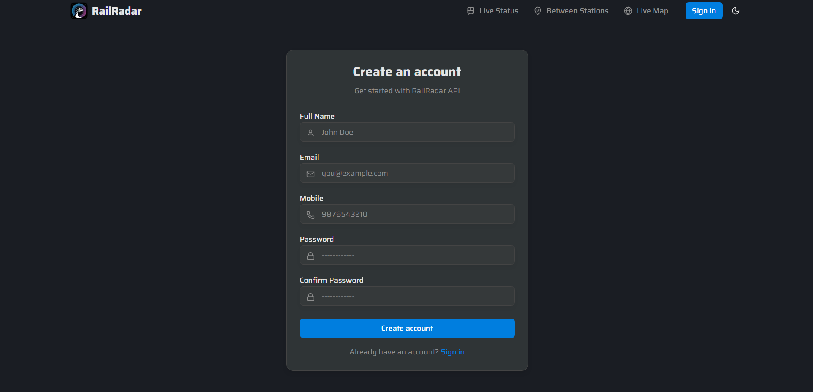
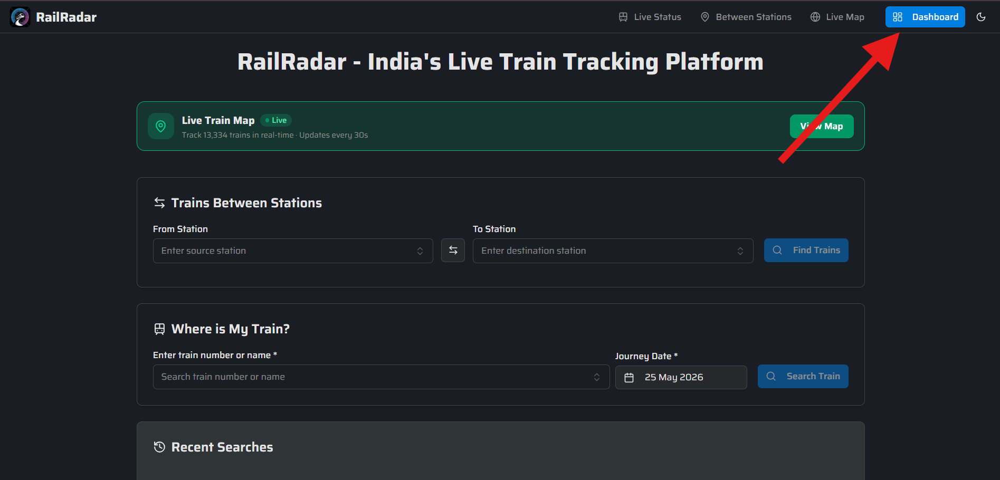

# How to Create a Rail Radar API Key

## Introduction
Rail Radar provides real-time train tracking and railway data through its API service. To access this data, you need to create an API key by registering on their platform. This guide walks you through the process using the Rail Radar registration portal.

---

## Step 1: Register on Rail Radar
1. Visit the [Rail Radar Registration Page](https://railradar.in/register) to create an account.  
     
   *Figure 1: Rail Radar Registration Page*

2. Fill in the required details (e.g., email, password, and confirm password).  
3. Click **"Register"** to complete the sign-up process.

---

## Step 2: Navigate to API Key Generation
1. Log in to your Rail Radar account.  
2. Locate the **"API Key"** section in your dashboard.  
     
   *Figure 2: API Key Generation Interface*

3. Follow the on-screen instructions to generate your API key. This typically involves:  
   - Selecting the type of API access you need.  
   - Confirming your account details.  
   - Generating the key via a secure method.

---

## Step 3: Use Your API Key
1. After generating the key, store it securely.  
2. Copy & Paste the key when running setup.py

*Copyright © 2026*